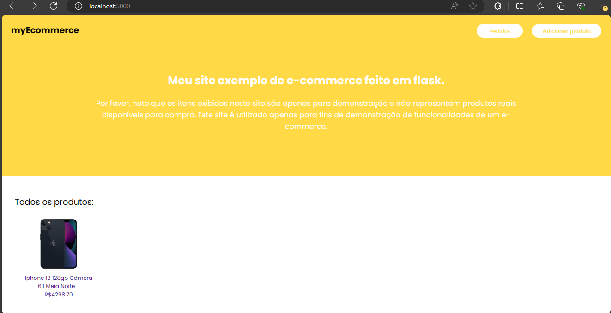

# E-Commerce Website

Este é um projeto de site de e-commerce feito em python com funcionalidades completas de backend. Ele oferece recursos como registro e login de usuários, gestão de pedidos e produtos, controle de estoque e status de compra, etc. O frontend não está completo.

## Funcionalidades

- **Autenticação de Usuários com Criptografia:** Os usuários podem se registrar e fazer login em suas contas.
- **Contas de Administrador:** Há uma conta de administrador com acesso privilegiado para gerenciar pedidos e produtos.
- **Gestão de Produtos:** Os administradores podem adicionar, editar e excluir produtos.
- **Controle de Estoque:** O sistema mantém o controle do estoque dos produtos.
- **Logout:** Os usuários podem fazer logout adicionando `/logout` ao final da URL.
- **Status da Compra:** Os usuários podem verificar o status de suas compras.
- **Visualização de Pedidos:** Os usuários podem ver detalhes de seus pedidos anteriores.

## Configuração

1. **Clonar o Repositório:** Clone este repositório em sua máquina local usando o seguinte comando:

   ```
   git clone https://github.com/LucasHonoratoDeSouza/Meu-Ecommerce.git
   ```

2. **Instalar Dependências:** Navegue até o diretório do projeto e instale as dependências usando:

   ```
   pip install -r requirements.txt
   ```

3. **Executar o Servidor:** Execute o servidor Flask com o seguinte comando:

   ```
   python app.py
   ```

4. **Acessar o Site:** Abra seu navegador e acesse `http://localhost:5000` para visualizar o site.

## Acesso de Teste

- **Conta de Administrador:**
  - **Usuário:** admin
  - **Senha:** admin

Para adicionar um usuário como administrador, é necessário acessar diretamente o banco de dados e alterar o valor da coluna `isSeller` para `True`.

## Contribuindo

Sinta-se à vontade para enviar pull requests com melhorias, correções de bugs ou novas funcionalidades. Se você tiver alguma dúvida ou problema, abra uma issue para discutirmos.

## Licença

Este projeto está licenciado sob a [Licença MIT](LICENSE).

## Importante

Este repositório contém o backend completo para um site de e-commerce, incluindo funcionalidades como gestão de pedidos, controle de estoque, registro e login de usuários. No entanto, é importante notar que **não inclui funcionalidades de pagamento** por motivos de segurança.

## Imagens

visão do admin:


